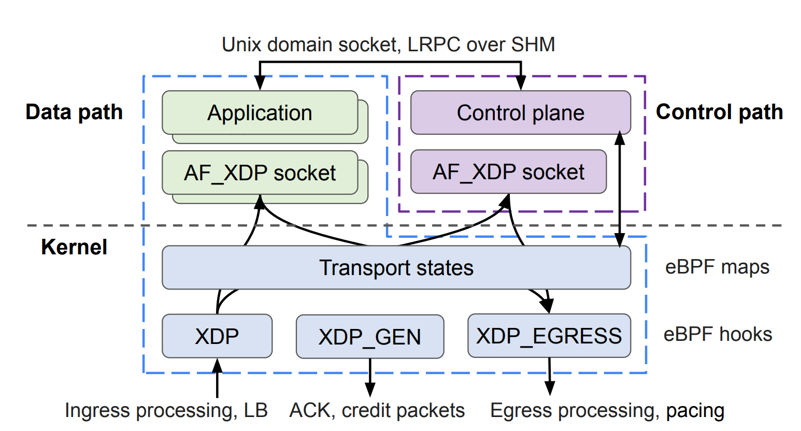

# **Replicating: "eTran: extensible kernel transport with eBPF"**

**Team Members:**

- Pierluigi Grossi, 10618314@polimi.it.
- Matteo Franken, 10831046@polimi.it.
- Lorenzo Chiroli, 10797603@polimi.it.

**Source Paper:** Zhongjie Chen, Qingkai Meng, ChonLam Lao, Yifan Liu, Fengyuan Ren, Minlan Yu,
and Yang Zhou: eTran: Extensible Kernel Transport with eBPF. In "22nd USENIX
Symposium on Networked Systems Design and Implementation (NSDI 25)", pages
407-425, Philadelphia, PA, 2025. USENIX Association.

_Paper URL_: <https://www.usenix.org/conference/nsdi25/presentation/chen-zhongjie>

**Project:** The repository contains the CloudLab profile used to set up the cluster, Ansible 
playbooks for configuring it, and runbooks documenting the procedures used to run the experiments 
and collect measurements.

_Project URL_: <https://github.com/lorenzo-cmyk/PF_NC_2025_26>

---

# **1. Introduction**

### **1. Motivation and Intuition**

The central contribution of eTran is a safe and extensible kernel transport framework that combines the protection of kernel networking with the development speed and performance techniques usually associated with user-space transports.

* **Limits of the native kernel stack (Linux TCP):** Modifying the Linux transport stack takes years. DCTCP took four years to enter the mainline kernel, MPTCP took almost a decade, and Homa, proposed in 2018, remains an external module. The traditional data path also has high costs due to socket and file system abstractions, heavy `sk_buff` structures, and repeated context switches for I/O system calls.
* **Risks of Kernel Bypass (User Space/DPDK):** Moving transport into user space enables fast evolution, but it removes kernel isolation and protection. A bug, crash, or malicious behavior in an application can alter acknowledgments, sequence numbers, or timers. It can also compromise the correctness of other tenants and prevent the kernel from enforcing global security policies, firewalling, and telemetry.
* **The eBPF solution and recent enablers:** eTran keeps transport state inside protected eBPF maps in the kernel, separate from application memory, with program safety checked by the statically verified eBPF verifier. Recent eBPF advances in the Linux kernel make this approach feasible today: `dynptr` in version 5.19, dynamic memory allocation in version 6.1, `rbtree` support in version 6.3, and new `kfuncs` allow eBPF programs to manage complex data structures that were previously impractical.

### **2. Limits of Standard eBPF and Linux Kernel Patches**

Native eBPF/XDP was designed for ingress inspection and lacks the capabilities required by a complete transport stack. To overcome these limitations, the authors extended the Linux kernel with approximately 2,500 lines of C code and introduced four main changes:

1. **New `XDP_EGRESS` Hook (Egress Handling and Isolation):** AF_XDP already supports egress: an application can transmit packets by placing descriptors on the TX ring. However, the stock AF_XDP path has no hook that invokes an eBPF program when a packet is added to the TX ring, so a kernel transport cannot validate or shape outgoing traffic through eBPF unless it can intercept it. The alternative of crafting the full TCP, Homa, IP, and Ethernet headers in userspace before transmission would mean trusting the application to produce correct packets, which contradicts the isolation goal of the framework. The `XDP_EGRESS` hook closes this gap. It is placed in the vendor-agnostic AF_XDP function `xsk_tx_peek_desc`, where the eBPF program intercepts every packet transmitted by AF_XDP, fills in the TCP, Homa, IP, and Ethernet headers, checks windows and rates, and applies pacing through `XDP_REDIRECT`. It adds an `umem_id` field to the packet context so that eTran can verify that the application's memory pool ID matches the pool registered for the connection, blocking spoofing attempts and unauthorized access.
2. **New `XDP_GEN` Hook (In-Kernel ACK/Credit Generation):** This hook is placed in `xdp_do_flush`, which runs at the end of a NAPI cycle. It avoids the cost of dynamic allocation: when the ingress path requires an ACK or credit, it pushes the metadata into a per-CPU queue. `XDP_GEN` retrieves the metadata, uses buffers pre-allocated through `page_pool`, and transmits control packets in high-speed batches.
3. **New `BPF_MAP_TYPE_PKT_QUEUE` Map and BPF Timers (Pacing):** This map stores pointers to deferred packets such as `xdp_frame` objects. It is integrated with BPF timers extended with two asynchronous execution modes: per-CPU execution through `NETTX_SOFTIRQ` for rate-based pacing, as used by TCP, and a global kernel thread for complex global scheduling, such as Homa credit management.
4. **Out-of-Order Completion Support for AF_XDP:** AF_XDP natively requires buffers to be recycled in order. Since eBPF pacing holds and delays some packets, the authors modified AF_XDP memory management and the network card driver, including approximately 20 lines of code in the Mellanox `mlx5` driver, to support asynchronous and out-of-order buffer completion and recycling.

### **3. Practical Architecture and Execution Flow**

eTran is organized into three components:

* **Control Path Daemon (Root User-Space Process):** A centralized manager with `root` privileges (the `micro_kernel` process) creates AF_XDP sockets, allocates UMEM, loads eBPF programs into the kernel, and manages connection handshakes such as the TCP SYN and ACK exchange. It runs floating-point congestion control by updating eBPF maps through shared `BPF_F_MMAPABLE` memory and handles retransmissions after severe timeouts.
* **Kernel Data Path (eBPF):** The transport engine runs inside the kernel. It performs high-speed I/O in the softirq and NAPI contexts while keeping connection state, timers, windows, and sequence numbers in protected BPF maps.
* **User Transport Library (`LD_PRELOAD` or RPC API):** An unprivileged library that is the application's only way onto the eBPF data path, since direct access requires `root` privileges and queue multiplexing and eTran deliberately does not trust applications with it. The library exposes a **Virtual AF_XDP Socket** and translates application calls into operations on shared AF_XDP ring buffers, so the application never touches kernel state directly. It can be linked at compile time, exposing both an RPC API and a new Socket API, or injected dynamically into an existing binary via `LD_PRELOAD`; the latter is possible because the Socket API is POSIX-compliant, making it a drop-in replacement for the standard socket interface.

#### **Practical Connection Lifecycle:**
1. **Setup and Handshake (Control Plane):** The application triggers a connection request: for example, it calls `socket()` or `connect()` through the Socket API, or it uses the RPC API directly. Either way, the library intercepts or translates the call and sends a request through **LRPC** to the root daemon. All privileged setup happens here, on the daemon's side: it creates the AF_XDP socket (which requires `root`/`CAP_NET_RAW`), allocates the UMEM as shared memory (`/dev/shm`), binds the socket to a NIC queue, and loads the eBPF programs. It then passes the already-configured socket file descriptor to the application through a Unix socket (`SCM_RIGHTS` fd passing), so that the unprivileged application can `mmap` the rings and the UMEM pages into its address space. The daemon also manages the network SYN/ACK handshake and installs the control information in the kernel's eBPF maps.
2. **Data Transfer (Direct Data Plane - Daemon Bypassed):** After setup, the daemon is out of the data path. During `write()`, the application copies data into the shared UMEM pages and submits descriptors on the TX ring. The `XDP_EGRESS` hook validates each packet (checking the `umem_id` against the pool registered for the connection), applies headers and pacing through the BPF maps, and transmits the packets. During `read()`, the `XDP` hook validates incoming packets, updates BPF state, and places them in the AF_XDP receive ring, where the application reads them directly.
3. **Trust Boundary and Crash Isolation:** The application only ever touches its own UMEM buffers and ring descriptors. It cannot load eBPF programs, read the stateful BPF maps (windows, sequence numbers, timers), or access other tenants' data. If the application crashes or misbehaves, it can at worst corrupt its own buffers: the kernel's network state remains protected and intact.

### **4. Case Studies and Validation**

As discussed, eTran is not a single protocol but an extension framework: its in-kernel primitives (`XDP_EGRESS`, `XDP_GEN`, `PKT_QUEUE`, BPF timers) span the full transport stack, from header generation to congestion control, flow control, and scheduling.

To demonstrate the feasibility of the platform, the authors implemented two proof-of-concept transports that cover opposite datacenter transport paradigms:

1. **TCP with DCTCP:** Built on classic **POSIX-like stream APIs**, it implements a connection-oriented, sender-driven transport with rate-based pacing.
2. **Homa:** In addition to POSIX-like APIs, the authors developed **RPC message APIs** and implemented Homa as a connectionless, receiver-driven transport with credit- and priority-based scheduling using SRPT.

---

# **2. Selected Results**

The selected results compare the eTran transports with their Linux counterparts: eTran-Homa vs. Linux-Homa (the Homa kernel module) and eTran-DCTCP vs. Linux-DCTCP (standard Linux TCP with `tcp_dctcp` and ECN). Each pair implements the same protocol, so protocol design cannot explain differences between the two stacks; any gap reflects the data path alone (eTran's eBPF machinery versus the kernel's).

| Paper metric | What is measured                                                                                                                                                                                                                                                                                                                                                                                       | Why it matters                                                                                    |
| ------------ | ------------------------------------------------------------------------------------------------------------------------------------------------------------------------------------------------------------------------------------------------------------------------------------------------------------------------------------------------------------------------------------------------------ | ------------------------------------------------------------------------------------------------- |
| 1            | A single client sends a 32B request to one server and waits for the echoed response before sending the next request. The round-trip time (RTT) P50 and P99 are recorded.                                                                                                                                                                                                                               | Measures the latency cost of the data path for a small request with no request-level concurrency. |
| 2            | A single client sends 1MB messages to one server back-to-back over a single stream. Sustained throughput is recorded.                                                                                                                                                                                                                                                                                  | Tests bulk data movement without contention from concurrent flows.                                |
| 3-4          | 500KB messages are sent concurrently either from 7 clients to 1 server (many-to-one) or from 1 client to 7 servers (one-to-many). Aggregate throughput is recorded.                                                                                                                                                                                                                                    | Tests scaling when several flows share a receiver or a sender.                                    |
| 5-6          | 32B RPCs (Remote Procedure Calls) are sent either from 7 clients to 1 server or from 1 client to 7 servers, with multiple requests outstanding (i.e., sent but not yet answered). The aggregate RPC rate is recorded in Kops or Mops.                                                                                                                                                                  | Measures small-message processing capacity and contention.                                        |
| 7-12         | Ten nodes act as both clients and servers in the W2-W5 all-to-all workloads shipped with the eTran benchmark suite, a fork of the original Homa benchmarking suite that generates test traffic using different statistical distributions. W2 and W3 emphasize short messages, while W4 and W5 emphasize large messages at higher offered loads. Overall and shortest-10% RTT P50 and P99 are recorded. | Tests incast, contention, and tail behavior under mixed message sizes.                            |
| 13-14        | A TCP client and server exchange 1KB or 2KB messages with 64 requests outstanding. Stream throughput is recorded.                                                                                                                                                                                                                                                                                      | Stream throughput under the same TCP/DCTCP protocol: any gap isolates the eBPF path.              |
| 15           | Five clients maintain 200 persistent TCP connections each, for 1,000 connections in total. Each connection sends 64B requests with one request outstanding (the next one is sent only after the response). Aggregate request rate is recorded.                                                                                                                                                         | Tests connection management and small-request processing at high concurrency.                     |
| 18           | Five clients run the `flexkvs` key-value workload over 100,000 keys, with 32B keys and 64B values, a 90% GET and 10% SET mix, and key popularity following a Zipf distribution with skew 0.9, so that most requests hit a few hot keys. Each client uses multiple connections with several requests outstanding. Throughput is recorded.                                                               | Tests the transports in an application-style workload dominated by reads to a few hot keys.       |
| 19-20        | A single client runs the same `flexkvs` key-value workload as metric 18, with one thread, one connection, and one request outstanding. Request-latency P50 and P99 are recorded.                                                                                                                                                                                                                       | Measures application responsiveness without saturation from competing requests.                   |
| 21-22        | CPU cycles per request are measured on the benchmark processes: metric 21 reuses the TCP `epoll` benchmark of metric 13 (1KB messages), and metric 22 reuses the Homa `cp_node` benchmark of metric 1 (32B RPCs).                                                                                                                                                                                      | Estimates the processing cost of each transport path.                                             |

# **3. Environment Setup**

The reproduction was conducted on the same physical CloudLab cluster used for the original experiments. The evaluation therefore used the same `xl170` node type, rack, Mellanox 2410 switch fabric, and official paper artifact as the authors. The hardware, software, and runtime configuration are described below.

### **Hardware Environment**

The cluster was provisioned at the CloudLab Utah site and contained ten physical nodes connected through the same rack switch:

* **Cluster:** Ten `xl170` nodes in one rack on the CloudLab Utah site.
* **CPU:** Single-socket Intel Xeon E5-2640 v4 at 2.40 GHz, with 10 physical cores and 20 logical CPUs per node.
* **Memory:** 64 GB ECC DDR4 RAM per node.
* **Storage:** A 16 GB CloudLab blockstore mounted at `/mydata` on each node.
* **Network Card:** Mellanox ConnectX-4 Lx 25 GbE NIC using the `mlx5` driver and the `ens1f1np1` interface.
* **Network Switch:** Mellanox 2410 25 GbE rack switch.

### **Software Environment**

The evaluation used the official repositories and the corresponding stack-specific software:

* **Operating System:** Ubuntu 22.04 LTS.
* **eTran kernel:** Custom `6.6.0-eTran+` kernel built from `eTran-linux`, including the eTran patches for `XDP_EGRESS`, `XDP_GEN`, `BPF_MAP_TYPE_PKT_QUEUE`, and AF_XDP out-of-order buffer completion.
* **eTran implementation:** `eTran`, including `micro_kernel`, `libetran.so`, the Homa application, and the TCP applications.
* **Linux-Homa kernel:** Linux-Homa was validated with the HomaModule kernel, built from Linux `v6.17.8` with the Homa module. This kernel is different from the custom `6.6.0-eTran+` kernel used by eTran.
* **Linux-DCTCP baseline:** The DCTCP setup reuses the eTran system setup and custom kernel, then builds the HomaModule `cp_node` utility and configures standard Linux TCP with DCTCP and ECN.
* **Linux-Homa baseline:** `PlatformLab/HomaModule`, including its `cp_node` benchmark utility and Homa kernel module.
* **Repositories:**
  * `https://github.com/eTran-NSDI25/eTran`
  * `https://github.com/eTran-NSDI25/eTran-linux`
  * `https://github.com/PlatformLab/HomaModule`
* **Recorded artifact revisions:**
  * `eTran`: `f26ef186bde0f9b3b899712e44112de47b7d5a65`, `Update README.md`, 2025-04-28.
  * `eTran-linux`: `3e96097421b41d3d9f2935d3405e956076c9d823`, `fix bug`, 2024-10-30.
  * `HomaModule`: `9edb95896ba874dcb64064a51099ae4b38c84617`, HEAD of `main` on 2026-07-09, `Add more material to INSTALL.md`, 2026-07-01.
* **Compiler and libraries:** GCC/G++ 11.4.0, Clang/LLVM, `libbpf`, `libelf`, and the other dependencies installed by the Ansible setup playbooks.

### **Configuration Parameters**

The main system and network parameters were kept consistent across the benchmark stacks:

* **Switch configuration:** The Mellanox 2410 used its default ECN configuration, including a 70 KB marking threshold. Direct access to the Mellanox switch was confirmed to be unavailable through CloudLab, so its default configuration could not be changed.
* **MTU:** The MTU was kept at 1500 bytes because the switch does not support jumbo frames for this experiment.
* **NIC coalescing:** Adaptive RX and TX coalescing were disabled. RX coalescing was set to zero microseconds with one frame, and TX coalescing was set to 5 microseconds.
* **Flow control:** NIC RX and TX flow control were disabled.
* **Offloads:** GRO and TSO remained enabled. Disabling either offload was found to hurt performance on this hardware.
* **Kernel tuning:** SMT was enabled, kernel mitigations were disabled, CPU C-states were disabled, and PCIe ASPM was disabled. The `network-throughput` profile from `tuned` was enabled.
* **eTran queues and CPU placement:** The eTran `micro_kernel` used its default 20 NIC queues. Its control loop was internally pinned to CPU 19 through `CP_CPU`; no external `taskset` was used for the micro-kernel or application threads. For eTran TCP, `ETRAN_NR_APP_THREADS` was set to the application thread count and `ETRAN_NR_NIC_QUEUES` was set to the same value.
* **DCTCP parameters:** The Linux-DCTCP baseline used `tcp_dctcp` as the congestion-control algorithm, enabled ECN with `net.ipv4.tcp_ecn=1`, and enabled TCP timestamps.
* **Linux-Homa parameters:** The Homa evaluation installed the `homa` qdisc on `ens1f1np1`, set `net.homa.max_gso_size=100000` and `net.homa.hijack_tcp=0`, and set the CPU governor to `performance`.
* **Network preparation:** Static ARP entries and `/etc/hosts` entries were installed for all nodes. The benchmark interface was `ens1f1np1`, with addresses in the `192.168.6.0/24` network.
* **Runtime parameters:** The workload-specific parameters included message size, `--client-max`, `--ports`, `--server-ports`, `--server-nodes`, `--one-way`, `--gbps`, `--both`, and `--id`, as specified by the metric runbooks.

No external dataset was used. The workloads were generated by the benchmark programs, including the W2-W5 Homa workloads and the `flexkvs` key-value workload.

### **Deviations from the Original Setup**

The hardware discrepancy between the paper's `xl170` specification and the provisioned nodes is discussed in Section 5.6. The remaining listed hardware characteristics matched the evaluation environment. The Linux-Homa validation uses the HomaModule Linux `v6.17.8` kernel, while eTran uses the custom `6.6.0-eTran+` kernel. This difference is required by the two stack implementations being compared, rather than being an experimental substitution. The official eTran and HomaModule sources were used, and the benchmark parameters were taken from the metric definitions and runbooks rather than replaced with a separate workload or dataset.

# **4. Experiment Result**

The measurements compare the local executions of eTran-Homa, Linux-Homa, eTran-DCTCP, and Linux-DCTCP. This section reports only values obtained from the benchmark runs on the reproduction cluster.

### **4.1 Execution Procedure**

The same basic procedure was used for each workload:

1. Stale benchmark processes were terminated by PID, and stale XDP programs were detached from the NIC when necessary. The process name was matched exactly to avoid killing the command used to perform the cleanup.
2. For eTran workloads, `/dev/shm/BufferPool_*`, `/dev/shm/UMEM_*`, and `/dev/shm/LRPC_*` were removed before changing metrics or workloads.
3. The stack-specific setup and evaluation playbooks were applied after reboot. These steps restored the network interface, ARP entries, hostname resolution, MTU, NIC tuning, Homa qdisc, and relevant sysctl values.
4. eTran `micro_kernel` instances and benchmark servers were started in `screen` sessions so that they retained a controlling terminal and continued running after the SSH command returned. Clients were launched with workload-specific timeouts and a 0.3 second stagger for multi-client tests.
5. Client output and server `screen` logs were collected after each run. The benchmark output was then parsed for RTT, throughput, RPC rate, latency percentiles, or CPU counters, depending on the metric.

The run durations were workload-specific. Single-stream and small-message tests generally used 15 second client runs, concurrent Homa tests used 30 seconds, TCP key-value tests used 20 to 45 seconds, and the all-to-all workloads used run times of 5, 10, 20, or 30 seconds depending on the offered load.

### **4.2 Measurement Method**

The benchmark programs reported the primary measurements directly:

* **Latency:** RTT distributions were collected from client output or from the all-to-all `dump_times` files. P50 and P99 denote the median and 99th percentile of the observed RTTs.
* **Throughput:** Stream and bulk-transfer throughput was read in Gbps from client output or server logs, depending on the traffic direction.
* **RPC rate:** Small-message workloads reported aggregate operations in Kops or Mops.
* **Application performance:** The `flexkvs` benchmark reported operations per second and request-latency percentiles.
* **CPU cost:** `perf stat` collected cycles and instructions for the CPU-cycle workloads. Cycles per request were computed from the total cycles, request rate, and active measurement time.

Each metric and configuration was run three times. Unless otherwise noted, the reported value is the arithmetic mean across the three runs. For latency metrics, P50 and P99 were computed from each run's per-request samples and then averaged across runs. Different workload configurations, such as `1x1`, `1x5`, and `5x5`, are reported separately. No confidence intervals or cross-run statistical model was applied. Where a row reports a range or a peak/steady-state pair, the entries represent separate configurations or operating points rather than confidence intervals or repeated-run variation.

### **4.3 Homa Measurements**

The Homa measurements covered small-message latency, bulk throughput, concurrent fan-in and fan-out, RPC rate, and ten-node all-to-all traffic.

| Metric | Workload                              |       eTran-Homa |          Linux-Homa |     Linux-DCTCP |
| ------ | ------------------------------------- | ---------------: | ------------------: | --------------: |
| 1      | 32B single-stream RTT, P50 / P99 (us) |    12.59 / 14.85 | 15.26 / about 25-35 |     22.7 / 26.4 |
| 2      | 1MB single-stream throughput (Gbps)   |             16.6 |         about 10-11 |            21.5 |
| 3      | 500KB, 7 clients to 1 server (Gbps)   | about 12.78-12.9 |            about 23 |            23.5 |
| 4      | 500KB, 1 client to 7 servers (Gbps)   |       about 19.5 |          about 23.1 |            23.5 |
| 5      | 32B RPC rate, 7 clients to 1 server   |   about 927 Kops |      about 1.1 Mops |  about 866 Kops |
| 6      | 32B RPC rate, 1 client to 7 servers   |  about 1120 Kops |      about 0.9 Mops | about 1082 Kops |

For the ten-node all-to-all workloads, each node acted as both a client and a server. The table reports RTT P50/P99 in microseconds. The `shortest-10%` columns contain the same percentiles after retaining the shortest 10 percent of the observed messages.

| Workload | eTran-Homa overall | Linux-Homa overall | eTran-Homa shortest-10% | Linux-Homa shortest-10% |
| -------- | -----------------: | -----------------: | ----------------------: | ----------------------: |
| W2       |         109 / 1344 |          94 / 9453 |                91 / 118 |                 19 / 21 |
| W3       |         115 / 1428 |         100 / 9511 |              110 / 1462 |                 20 / 22 |
| W4       |       3068 / 13713 |       128 / 224000 |            2848 / 12604 |                 22 / 24 |
| W5       |     18007 / 130044 |      1135 / 404000 |           14530 / 48026 |                 61 / 84 |

The W4 and W5 eTran runs were performed at 20 Gbps offered load. Their observed queues continued to grow because the offered load exceeded the measured drain rate. These rows are therefore retained as measurements of the overloaded local system rather than as steady-state latency measurements.

### **4.4 TCP and DCTCP Measurements**

The TCP measurements covered streaming throughput, persistent connections, a key-value workload, request latency, and CPU cost.

| Metric | Workload                                            |                                                                      eTran-DCTCP |                        Linux-DCTCP |
| ------ | --------------------------------------------------- | -------------------------------------------------------------------------------: | ---------------------------------: |
| 13     | 1KB streaming throughput, 64 outstanding            | 1x1: 7.19 Gbps / 878 Kops; 1x5: 12.1 Gbps / 1474 Kops; 5x5: 7.55 Gbps / 922 Kops |        1.8-2.8 Gbps / 222-346 Kops |
| 14     | 2KB streaming throughput, 64 outstanding            |                                                            12.29 Gbps / 750 Kops |        1.8-4.6 Gbps / 111-283 Kops |
| 15     | 1K persistent connections, 64B closed-loop requests |                                      about 1129 Kops peak; about 655 Kops steady |                     about 234 Kops |
| 18     | `flexkvs` throughput                                |                                                                  about 0.73 Mops |                   about 0.278 Mops |
| 19     | `flexkvs` request latency P50                       |                                                                            14 us | 17 us idle; 36 us at 320 in-flight |
| 20     | `flexkvs` request latency P99                       |                                                                            16 us |                         24 us idle |
| 21     | TCP CPU cycles per request                          |                                                  about 2.93 kcycles, server-side |     about 7.4 kcycles, client-side |

The Homa CPU measurement was recorded separately because it uses the Homa benchmark process rather than the TCP application:

| Metric | Workload               |                                                                             eTran-Homa |         Linux-Homa |
| ------ | ---------------------- | -------------------------------------------------------------------------------------: | -----------------: |
| 22     | CPU cycles per request | about 1357 kcycles including AF_XDP busy-polling; about 5 kcycles of active processing | about 18.6 kcycles |

### **4.5 Correctness Checks and Debugging**

Correctness was checked before collecting measurements. Network preparation verified IP forwarding, permanent ARP entries, `/etc/hosts`, hostname resolution, ping reachability, MTU, NIC coalescing, and flow control. Stack-specific checks verified the running kernel, required binaries, loaded Homa module, eTran objects, DCTCP sysctls, and Homa qdisc. Server and client logs were also checked for completed operations and nonzero throughput before values were retained.

Several operational issues affected the measurement process. Stale eTran shared-memory objects and BPF state caused runs to stall with zero completions, so shared memory was cleaned between metrics and `micro_kernel` was restarted. A killed `micro_kernel` could leave an XDP program attached to the NIC; detaching XDP before restarting fixed the subsequent silent startup failure. Running `micro_kernel` or the server under `timeout` caused premature termination, so both were kept in `screen` sessions and only clients were given timeouts. The `pkill -f micro_kernel` pattern could also terminate its own wrapper, so cleanup used exact process names and explicit PIDs instead.

### **4.6 Key Takeaways**

The local measurements reveal a workload-dependent performance profile for eTran.

**Where eTran Performs Well:**

* **TCP throughput and scalability:** In the measured configurations, eTran-DCTCP achieved higher throughput and request rates than Linux-DCTCP. It reached 12.29 Gbps for 2KB streaming messages, 655 Kops in steady state with 1,000 persistent connections, and 0.73 Mops on the `flexkvs` workload.
* **Application performance:** eTran-DCTCP recorded 14 us P50 and 16 us P99 latency for the low-load `flexkvs` workload. Linux-DCTCP recorded 17 us P50 and 24 us P99 under the corresponding idle configuration. Its separate 36 us P50 value was measured with 320 requests in flight.
* **Single-stream RPC latency:** eTran-Homa recorded the lowest unloaded 32B single-stream RTT in the measured set, with 12.59 us P50 and 14.85 us P99, compared with 15.26 us P50 for Linux-Homa.

**Where eTran Struggles:**

* **Concurrent fan-in throughput:** In the 500KB, 7-client-to-1-server workload, eTran-Homa reached about 12.8-12.9 Gbps, while Linux-Homa and Linux-DCTCP reached about 23 Gbps. The measured bottleneck was serialized `XDP_GEN` grant dispatch rather than server parallelism or the number of server threads.
* **Shortest-10% latency in all-to-all traffic:** In W2 and W3, Linux-Homa recorded lower P50 latency for the shortest 10% of messages, at 19-20 us, while eTran-Homa recorded 91-110 us.
* **Overloaded queue buildup:** At the 20 Gbps offered load used for W4 and W5, eTran-Homa could not drain traffic as quickly as it arrived. The resulting queues grew continuously, and P99 RTT reached 13713 us in W4 and 130044 us in W5. These values describe an overloaded local system rather than steady-state behavior.

**CPU Measurements:**

The Homa CPU measurement separates total busy-polling cost from active processing. eTran-Homa consumed about 1357 kcycles per request when the full busy-polling interval was counted, but about 5 kcycles when only active processing was considered. For metric 21, the measured process-scoped costs were about 2.93 kcycles per request for eTran-DCTCP on the server and about 7.4 kcycles for Linux-DCTCP on the client. The measurement scopes differ, so these values should be treated as indicative rather than as a direct reduction from one implementation to the other.

# 5. Reproducibility Assessment of the Paper

The local measurements do not reproduce the reported evaluation as a whole. A few isolated results are close to the reported values, especially single-stream latency and some TCP application workloads, but the main Homa scalability results show substantial gaps. Several experiments also could not be reproduced with the available artifact. The comparison below uses the measurements from Section 4 and the values reported by the authors.

### **5.1 Homa Results**

The largest differences appear in concurrent Homa workloads:

| Metric                                 | Measured: eTran-Homa / Linux-Homa | Reported: eTran / Linux-Homa |
| -------------------------------------- | --------------------------------: | ---------------------------: |
| 1, 32B RTT P50 (us)                    |                     12.59 / 15.26 |                  11.8 / 15.6 |
| 2, 1MB throughput (Gbps)               |                16.6 / about 10-11 |                  17.7 / 14.5 |
| 3, 500KB, 7 clients to 1 server (Gbps) |             about 12.8 / about 23 |                  23.0 / 23.1 |
| 4, 500KB, 1 client to 7 servers (Gbps) |           about 19.5 / about 23.1 |                  22.7 / 22.9 |
| 5, 32B RPC rate, 7 clients to 1 server |   about 927 Kops / about 1.1 Mops |          2.9 Mops / 1.7 Mops |
| 6, 32B RPC rate, 1 client to 7 servers |  about 1120 Kops / about 0.9 Mops |          3.3 Mops / 1.8 Mops |

Metric 1 was close for both implementations, and eTran-Homa metric 2 also reached a similar throughput. The concurrent metrics were different: eTran-Homa reached only about 12.8 Gbps in metric 3 compared with the roughly 23 Gbps measured for both Linux-Homa and Linux-DCTCP, and its RPC rates in metrics 5 and 6 were substantially lower than the reported values. The local Linux-Homa metric 2 result also varied between about 10-11 Gbps and 17.9 Gbps across sessions, so that workload was not stable on the reproduction cluster.

For W2 and W3, the local overall P99 RTTs were 1344 us and 1428 us for eTran-Homa, compared with 9453 us and 9511 us for Linux-Homa. However, the shortest-10% P50 values were 91 us and 110 us for eTran-Homa, compared with 19 us and 20 us for Linux-Homa. The W4 and W5 eTran runs were overloaded at the offered 20 Gbps load and therefore do not provide steady-state comparisons.

### **5.2 TCP and DCTCP Results**

The TCP results were more favorable, but they still do not establish a complete reproduction of the reported evaluation:

* **Metric 13:** The local eTran-DCTCP to Linux-DCTCP throughput ratios were about 3.95x for 1x1, 3.98x for 1x5, and 2.79x for 5x5, compared with the reported 4.8x ratio.
* **Metric 14:** eTran-DCTCP reached 12.29 Gbps, while Linux-DCTCP ranged from 1.8 to 4.6 Gbps.
* **Metric 15:** The local steady-state ratio was about 2.8x, compared with the reported 2.26x target.
* **Metric 18:** The local `flexkvs` ratio was about 2.6x, within the reported local comparison range of 2.4-4.8x.
* **Metrics 19-20:** eTran-DCTCP measured 14 us P50 and 16 us P99, while Linux-DCTCP measured 17 us P50 and 24 us P99 in the idle configuration. The corresponding reported eTran values were 17.2 us P50 and 27.5 us P99.
* **Metric 21:** The local CPU values cannot be compared directly with the reported component totals because the local measurements were process-scoped and used different processes for eTran-DCTCP and Linux-DCTCP.
* **Metric 22:** The active eTran-Homa processing cost was about 5 kcycles, close to the reported active-processing value, while the raw eTran value was about 1357 kcycles because of AF_XDP busy-polling. The Linux-Homa value was about 18.6 kcycles.

### **5.3 Reproducibility Assessment**

The reproduction therefore failed in the broad sense: it did not reproduce the complete performance profile across the Homa and TCP metric suite. The failure was not uniform. Single-stream latency, several TCP workloads, and the low-load key-value measurements were close to or better than the reported local values, but eTran-Homa did not sustain the expected performance under concurrent fan-in, small-message RPC load, or high offered load.

The evaluation was also incomplete. The public artifact did not contain the short-lived TCP benchmark required for metrics 16-17, and the standalone BPF programs needed for the XDP_EGRESS and XDP_GEN microbenchmarks were unavailable. The Homa CPU comparison used different workloads for eTran-Homa and Linux-Homa, and the W4/W5 eTran measurements were overloaded. These limitations prevent a complete one-to-one reproduction, even though the available benchmark suite was sufficient to expose the main performance bottlenecks in the local system.

Overall, the artifact was usable for building and running the principal eTran, Linux-Homa, and Linux-DCTCP workloads, but it was not sufficient to reproduce the entire evaluation. The reproduction should therefore be classified as partial and, for the paper's overall claims, unsuccessful.

### **5.4 Investigation of the Reproduction Gap**

The authors provide the main benchmark utilities, but one required utility is missing: the public eTran repository does not include the short-lived TCP connection benchmark used for metrics 16-17. The available `epoll_client` supports persistent connections only. The authors also do not provide per-metric example commands or scripts showing how to reproduce the reported measurements. The execution details had to be reconstructed from the available documentation and source code, including the command-line flags, process startup order, client and server roles, runtime, warm-up behavior, and output aggregation. Different choices in any of these details can change the workload that is actually measured, even when the same benchmark utility and message size are used.

As a result, it is possible that some of the local measurements do not exercise exactly the same workloads as the authors' measurements. The discrepancy cannot be resolved from the artifact alone. The authors were contacted for clarification, but no response was received.

### **5.5 Kernel Compatibility of the Stated Linux-Homa Baseline**

The stated Linux-Homa baseline contains a separate compatibility problem. The paper identifies HomaModule commit `8321cde` from March 2023 and Linux `6.6.0`. Source-level analysis shows that this combination cannot compile unmodified.

HomaModule commit `8321cde` still initializes the `.sendpage` field in both `struct proto_ops` and `struct proto`, and defines its Homa ioctl handler with the pre-6.5 signature using `unsigned long arg`. Linux 6.5 removed `sendpage` from both protocol structures and changed the `struct proto` ioctl argument to `int *karg`. The old Homa source therefore does not match the Linux 6.6 kernel APIs.

The same commit uses `kthread_complete_and_exit`, which is available by Linux 5.17. Together with the pre-6.5 socket APIs and the commit's `linux_6.0` branch, this identifies the source as a Linux 6.0-era implementation and, in any case, rules out Linux 6.5 and later. Later HomaModule fixes, including commit `df0daa5a9`, updated the ioctl and `sendpage` interfaces, but introduced `#include <net/rps.h>`. That header is absent from Linux 6.6, 6.7, and 6.8, and is available starting with Linux 6.9. The later fix therefore does not provide a Linux 6.6 solution either.

The reproduction used a functional compatibility path instead: the Ansible pipeline built mainline Linux `v6.17.8` and HomaModule `main` at commit `9edb95896ba874dcb64064a51099ae4b38c84617`. This allowed Linux-Homa to run, but it is not the Linux 6.6 and `8321cde` combination stated for the baseline. The contradiction is therefore a reproducibility problem in the published setup, not merely a performance difference observed during the experiments.

### **5.6 Hardware Specification Discrepancy**

The paper describes the `xl170` instance as having two CPUs with 10 cores each. The provisioned `xl170` nodes instead had one Intel Xeon E5-2640 v4 CPU with 10 physical cores and 20 logical CPUs with SMT enabled. The other listed hardware characteristics matched the evaluation environment, including memory, the ConnectX-4 Lx NIC, the 25 GbE network, and the Mellanox 2410 switch.

This is a minor hardware discrepancy, but it reduces the available physical-core capacity compared with the hardware configuration described in the paper. It may affect highly concurrent workloads, although it does not account for the separate kernel compatibility problem or the missing reproduction instructions.

# 6. Further Exploration

In this project you are required to also explore a research question of your own. Either:

1. Take the same test with different input workload or a variation of a test that is not present in the paper and comment the results you obtain
1. Implement a new feature on top of the system you evaluated and show a figure showing the performance

Discuss which approach you take, and what you explored. Explain what was your
motivation and importance of your question.

## 6.1. Methodology and Result

Report the experiment you designed for answering the question and share the
result you got.

Include:

- Graph(s) or table(s)
- How the experiment was conducted (share the details)
- What did you discover?

# 7. Conclusion

Conclude the report by mentioning the takeaways of experiments you did

---

# Appendix

You are asked to write this report using Markdown. You can find a cheat sheet
of Markdown syntax at this [link](https://rust-lang.github.io/mdBook/format/markdown.html).

For generating a PDF file from your report you can use a tool of your choice.
*md2pdf* is one such tool. See this [link](https://pypi.org/project/md2pdf/)
for more information about it. You can also use an online editor such as [this](https://www.md2pdf.io/).

