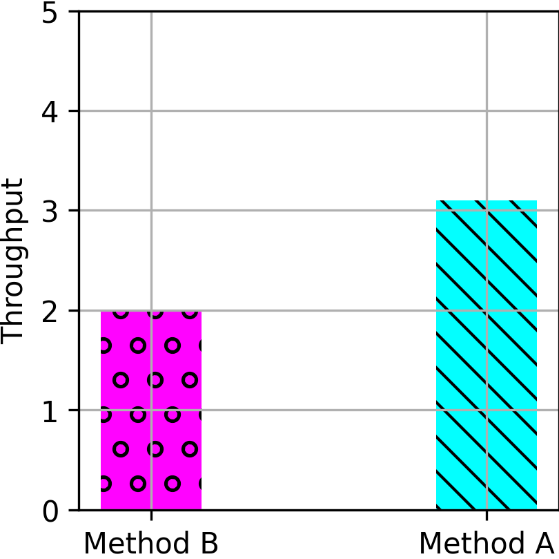

# Replicating: "eTran: extensible kernel transport with eBPF"

**Team Members:**

- Pierluigi Grossi, 10618314@polimi.it.
- Matteo Franken, 10831046@polimi.it.
- Lorenzo Chiroli, 10797603@polimi.it.

**Source Paper:** Zhongjie Chen, Qingkai Meng, ChonLam Lao, Yifan Liu, Fengyuan Ren, Minlan Yu,
and Yang Zhou: eTran: Extensible Kernel Transport with eBPF. In "22nd USENIX
Symposium on Networked Systems Design and Implementation (NSDI 25)", pages
407-425, Philadelphia, PA, 2025. USENIX Association.

_Paper URL_: <https://www.usenix.org/conference/nsdi25/presentation/chen-zhongjie>

**Project:** The repository contains the CloudLab profile used to set up the cluster, Ansible 
playbooks for configuring it, and runbooks documenting the procedures used to run the experiments 
and collect measurements.

_Project URL_: <https://github.com/lorenzo-cmyk/PF_NC_2025_26>

---

# **1. Introduction**

### **1. Motivation and Intuition**

The central contribution of eTran is a safe and extensible kernel transport framework that combines the protection of kernel networking with the development speed and performance techniques usually associated with user-space transports.

* **Limits of the native kernel stack (Linux TCP):** Modifying the Linux transport stack takes years. DCTCP took four years to enter the mainline kernel, MPTCP took almost a decade, and Homa, proposed in 2018, remains an external module. The traditional data path also has high costs due to socket and file system abstractions, heavy `sk_buff` structures, and repeated context switches for I/O system calls.
* **Risks of Kernel Bypass (User Space/DPDK):** Moving transport into user space enables fast evolution, but it removes kernel isolation and protection. A bug, crash, or malicious behavior in an application can alter acknowledgments, sequence numbers, or timers. It can also compromise the correctness of other tenants and prevent the kernel from enforcing global security policies, firewalling, and telemetry.
* **The eBPF solution and recent enablers:** eTran keeps transport state inside protected eBPF maps in the kernel, separate from application memory, with program safety checked by the statically verified eBPF verifier. Recent eBPF advances in the Linux kernel make this approach feasible today: `dynptr` in version 5.19, dynamic memory allocation in version 6.1, `rbtree` support in version 6.3, and new `kfuncs` allow eBPF programs to manage complex data structures that were previously impractical.

### **2. Limits of Standard eBPF and Linux Kernel Patches**

Native eBPF/XDP was designed for ingress inspection and lacks the capabilities required by a complete transport stack. To overcome these limitations, the authors extended the Linux kernel with approximately 2,500 lines of C code and introduced four main changes:

1. **New `XDP_EGRESS` Hook (Egress Handling and Isolation):** This hook is placed in the vendor-agnostic AF_XDP function `xsk_tx_peek_desc`. It allows eBPF to intercept packets transmitted by AF_XDP, fill in TCP, Homa, IP, and Ethernet headers, check windows and rates, and apply pacing through `XDP_REDIRECT`. It adds an `umem_id` field to the packet context so that eTran can verify that the application's memory pool ID matches the pool registered for the connection, blocking spoofing attempts and unauthorized access.
2. **New `XDP_GEN` Hook (In-Kernel ACK/Credit Generation):** This hook is placed in `xdp_do_flush`, which runs at the end of a NAPI cycle. It avoids the cost of dynamic allocation: when the ingress path requires an ACK or credit, it pushes the metadata into a per-CPU queue. `XDP_GEN` retrieves the metadata, uses buffers pre-allocated through `page_pool`, and transmits control packets in high-speed batches.
3. **New `BPF_MAP_TYPE_PKT_QUEUE` Map and BPF Timers (Pacing):** This map stores pointers to deferred packets such as `xdp_frame` objects. It is integrated with BPF timers extended with two asynchronous execution modes: per-CPU execution through `NETTX_SOFTIRQ` for rate-based pacing, as used by TCP, and a global kernel thread for complex global scheduling, such as Homa credit management.
4. **Out-of-Order Completion Support for AF_XDP:** AF_XDP natively requires buffers to be recycled in order. Since eBPF pacing holds and delays some packets, the authors modified AF_XDP memory management and the network card driver, including approximately 20 lines of code in the Mellanox `mlx5` driver, to support asynchronous and out-of-order buffer completion and recycling.

### **3. Practical Architecture and Execution Flow**

eTran is organized into three components:

* **Control Path Daemon (Root User-Space Process):** A centralized manager with `root` privileges creates AF_XDP sockets, allocates UMEM, loads eBPF programs into the kernel, and manages connection handshakes such as the TCP SYN and ACK exchange. It runs floating-point congestion control by updating eBPF maps through shared `BPF_F_MMAPABLE` memory and handles retransmissions after severe timeouts.
* **Kernel Data Path (eBPF):** The transport engine runs inside the kernel. It performs high-speed I/O in the softirq and NAPI contexts while keeping connection state, timers, windows, and sequence numbers in protected BPF maps.
* **User Transport Library (`LD_PRELOAD` or RPC API):** An unprivileged library in the application exposes a **Virtual AF_XDP Socket**. It groups NIC queues and converts application calls into operations on shared AF_XDP ring buffers.

#### **Practical Connection Lifecycle:**
1. **Setup and Handshake (Control Plane):** The application calls `socket()` or `connect()`. The `LD_PRELOAD` library intercepts the call and sends a request through **LRPC** to the root daemon. The daemon allocates the AF_XDP socket and UMEM, passes the file descriptor to the application through a Unix socket, manages the network SYN/ACK handshake, and installs the control information in the kernel's eBPF maps.
2. **Data Transfer (Direct Data Plane - Daemon Bypassed):** During `write()`, the application places data in the AF_XDP ring buffers. The `XDP_EGRESS` hook reads the data, applies headers and pacing through the BPF maps, and transmits the packets. During `read()`, the `XDP` hook validates incoming packets, updates BPF state, and places them in the AF_XDP receive ring, where the application reads them directly.
3. **In Case of an Application Crash:** The user library is isolated and cannot access the BPF state in the kernel. If the application crashes, the kernel's network state remains protected and intact.

### **4. Case Studies and Validation**

As discussed, eTran is not a single protocol but an extension framework that provides in-kernel primitives, including `XDP_EGRESS`, `XDP_GEN`, `PKT_QUEUE`, and BPF timers, for programming transport logic such as congestion control, pacing, and loss recovery.

To demonstrate the feasibility of the platform, the authors implemented two proof-of-concept transports that cover opposite datacenter transport paradigms:

1. **TCP with DCTCP:** Built on classic **POSIX-like stream APIs**, it implements a connection-oriented, sender-driven transport with rate-based pacing.
2. **Homa:** In addition to POSIX-like APIs, the authors developed **RPC message APIs** and implemented Homa as a connectionless, receiver-driven transport with credit- and priority-based scheduling using SRPT.

---

# 2. Selected Result

Mention which result of the paper you are reproducing, and explain its importance.

For example:

> "Figure 1 shows that method A improves throughput by 35% over method B under workload *W*. This experiment shows that paper can effectively overcome the motivated challenge."

{width=30%}

# 3. Environment Setup

*Note:* This section should contain enough information to allow someone else to
reproduce *your* report. Share hardware and/or software setup relevant to your
experiment. For example:

**Hardware Environment:**
CPU, Memory, Storage, Network, Cloud / local / cluster, Any relevant micro-architectural details

**Software Environment**
OS version, Kernel version, Compiler version, Libraries, Dependencies, Paper artifact used (Yes/No; version/commit hash)

**Configuration Parameters:**

- Workload configuration
- Dataset
- Runtime parameters and flags

**Deviations from the Original Setup:**

Clearly describe any difference between papers and your experiment environment.

- Hardware differences
- Software version differences
- Dataset substitutions
- Unavailable components

Explain why these deviations were necessary.

If something was **missing in the original paper**, state it. For example:

> The paper does not specify X. We assumed Y (or explored range *a* to *b*).

# 4. Experiment Result

> Explain how your experiment was conducted and then what results you acquired. 
Afterwards, compare your results with those of the paper and state your
takeaways.

Step-by-step description:

1. Execution procedure
1. Measurement method
1. Number of runs
1. Statistical treatment (mean, median, CI, etc.)

Also Describe:

- How did you ensure correctness (did you check also other metrics to make sure the experiment is running correctly?)
- Did you do any debugging? Discuss issues you faced and how you overcame them (if applicable consider allocating a subsection for this item) 

Share your result and compare them with the paper's. Then discuss your takeaways.

For comparison include:

- Graph(s) or table(s)
- Matching axes and units with the source paper
- Error bars if applicable
- You may want to report difference with the original results (e.g., absolute
number or percentage).

For example:

{width=30%}

{width=30%}

> **Reminder:** the goal is not achieve the exact results of the paper, but to do a rigorous experiment with similar assumptions from the source paper and gain insight. The insight can be correctness of work, failure to reproduce same results, or even infeasibility of doing such experiment for interesting reasons.

# 5. Further Exploration

In this project you are required to also explore a research question of your own. Either:

1. Take the same test with different input workload or a variation of a test that is not present in the paper and comment the results you obtain
1. Implement a new feature on top of the system you evaluated and show a figure showing the performance

Discuss which approach you take, and what you explored. Explain what was your
motivation and importance of your question.

## 5.1. Methodology and Result

Report the experiment you designed for answering the question and share the
result you got.

Include:

- Graph(s) or table(s)
- How the experiment was conducted (share the details)
- What did you discover?

# 6. Reproducibility Assessment of the Paper

Evaluate the paper itself:

- Was the methodology clearly described?
- Was the artifact usable?
- How difficult was reproduction?

# 7. Conclusion

Conclude the report by mentioning the takeaways of experiments you did

---

# Appendix

You are asked to write this report using Markdown. You can find a cheat sheet
of Markdown syntax at this [link](https://rust-lang.github.io/mdBook/format/markdown.html).

For generating a PDF file from your report you can use a tool of your choice.
*md2pdf* is one such tool. See this [link](https://pypi.org/project/md2pdf/)
for more information about it. You can also use an online editor such as [this](https://www.md2pdf.io/).

